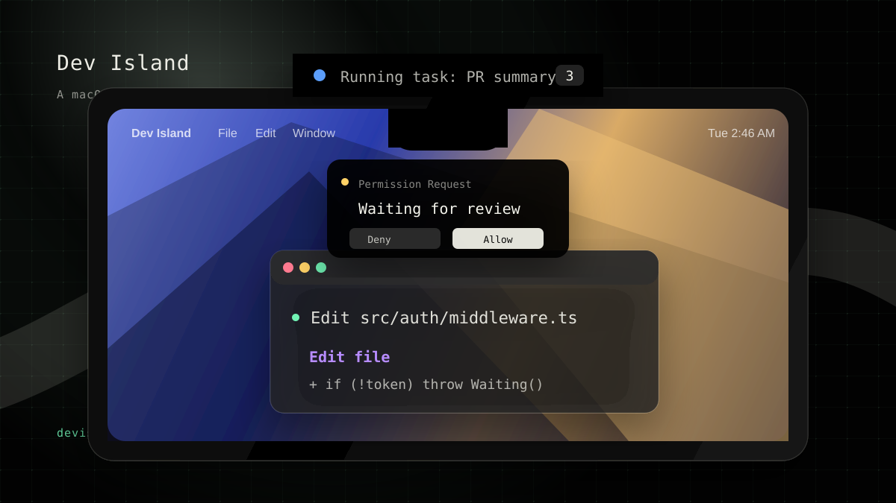
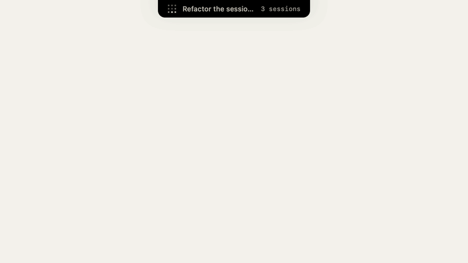

# Dev Island

A macOS island for AI agent tasks.

<p align="center">
  <a href="https://devisland.app"></a>
  <a href="https://github.com/sheepxux/Dev-Island"></a>
  <a href="https://github.com/sheepxux/Dev-Island/stargazers"></a>
  
  
  
  <a href="LICENSE"></a>
</p>

Dev Island keeps long-running agent work visible without making you keep a browser,
terminal, or dashboard in front. The compact island shows the current task state
and count at a glance, then expands into a local task console when you need more
context.

<p align="center">
  
</p>

## Preview

<p align="center">
  
</p>

## Why

AI agents are useful because they keep working after you switch away. That also
makes them easy to forget.

Dev Island gives that background work a small, persistent surface on macOS:
running tasks stay visible, waiting tasks can ask for attention, and failures do
not disappear inside another tab.

## Highlights

- Compact notch or simulated-island view with a status dot and task count.
- Works on notched Macs and non-notched Macs.
- Expandable runtime panel for active, waiting, completed, and failed tasks.
- Manus connector with local API-key storage and task sync.
- Webhook tunnel support through `cloudflared`, with polling fallback when a
  tunnel is unavailable.
- Launch at Login and local settings UI.
- Swift package architecture with a narrow `TaskStore` interface between UI and
  core data code.

## Current Status

| Area | Status |
| --- | --- |
| macOS island UI | Active development |
| Simulated island for non-notched Macs | Active development |
| Manus task sync | Implemented and field-tested |
| Webhook tunnel | Experimental, with polling fallback |
| Claude Code connector | Planned |
| Cursor connector | Planned |
| Signed public download | Pending release workflow |

## Sources

| Source | Support |
| --- | --- |
| Manus | Available |
| Claude Code | Planned |
| Cursor | Planned |

## Requirements

- macOS 14 or newer.
- Xcode or Swift 5.10 toolchain.
- Optional: `cloudflared` for webhook tunnel mode.

## Run From Source

```bash
swift build
swift run IslandApp
```

Run tests:

```bash
swift test
```

Build a local `.app` bundle:

```bash
scripts/build-app.sh
```

The bundle is written to `build/Island.app`. Local bundles are ad-hoc signed for
testing; Developer ID signing and notarization belong to the release workflow.

## Configuration

Open Dev Island settings from the macOS menu bar, then connect a Manus API key.
Keys are stored locally through Keychain-backed storage. When `cloudflared` is
available, Dev Island can receive webhook updates; otherwise the app falls back
to polling.

## Architecture

This repository is an SPM-native macOS project.

| Target | Role |
| --- | --- |
| `IslandApp` | Tiny executable shim and app entry point |
| `IslandAppLib` | SwiftUI UI layer, windows, settings, island presentation |
| `IslandCore` | Connectors, persistence, task state, webhooks, tunnel handling |
| `IslandCoreCLI` | CLI integration/testing utility |

The UI and core layers communicate through the public `TaskStore` surface. See
[`docs/INTERFACE_CONTRACT.md`](docs/INTERFACE_CONTRACT.md) before changing that
contract.

## Distribution Notes

The release tooling is being prepared around a signed macOS app and a Homebrew
Cask. The draft Cask lives in [`dist/homebrew-island`](dist/homebrew-island).

The official website is [devisland.app](https://devisland.app).

## License

Dev Island is released under the [MIT License](LICENSE).

## Project Ownership

- `IslandApp/` and `IslandAppLib/` cover the macOS UI surface.
- `IslandCore/` covers data, connectors, persistence, and sync.
- `TaskStore` is the shared contract between those layers.

For interface rules and change requests, see
[`docs/INTERFACE_CONTRACT.md`](docs/INTERFACE_CONTRACT.md).
