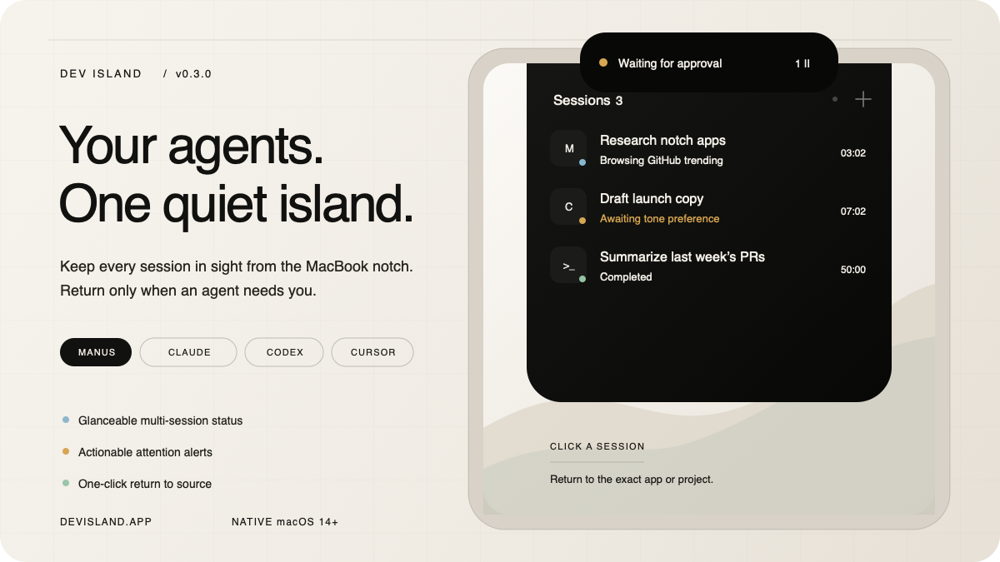

<div align="center">


# Dev Island

**Your agents. One quiet island.**

A calm, native macOS surface for every AI agent working in the background.<br>
把所有后台运行的 AI Agent，收进 MacBook 顶部的一座安静小岛。

<p><a href="#english">English</a> · <a href="#简体中文">简体中文</a></p>

<p>
  <a href="https://devisland.app"></a>
  <a href="https://github.com/sheepxux/Dev-Island/releases/latest"></a>
  
  <a href="LICENSE"></a>
</p>

<a href="https://devisland.app">
  
</a>

<p>
  <strong><a href="https://devisland.app">Download from devisland.app →</a></strong>
  &nbsp;&nbsp;·&nbsp;&nbsp;
  <a href="https://github.com/sheepxux/Dev-Island/releases/latest">GitHub Releases</a>
</p>

</div>

---

<a id="english"></a>

## English

AI agents keep working after you leave their window. That is useful—until one
needs approval, finishes quietly, or disappears inside a pile of terminals.

Dev Island keeps those sessions visible in one small surface around the
MacBook notch. It stays compact while work is moving, asks for attention only
when necessary, and lets you jump back to the exact app or project with one
click.

### The whole experience in six seconds

<div align="center">
  
</div>

### Made to stay out of the way

| | Experience |
| --- | --- |
| **Glance** | See running, waiting, failed and completed work without opening another dashboard. |
| **Notice** | Receive a native notification when a session needs input or fails. Completion alerts are optional. |
| **Return** | Open the island on the exact task, then jump back to its source app, terminal or browser. |
| **Focus** | Collapse to a quiet status surface. Reduced Motion is respected throughout the interface. |

The panel adapts to the number of sessions instead of reserving a large fixed
window. On Macs without a notch—or while using an external display—the
menu-bar item keeps the same controls within reach.

### Supported agents

| Agent | Connection | Where data flows |
| --- | --- | --- |
| **Manus** | API sync with realtime webhook and polling fallback | Manus API; key stored in macOS Keychain |
| **Claude Code** | Local lifecycle hooks | Loopback only (`127.0.0.1`) |
| **Codex** | Local lifecycle hooks | Loopback only (`127.0.0.1`) |
| **Cursor** | Local lifecycle hooks | Loopback only (`127.0.0.1`) |

Local integrations need no Dev Island account and no API key. Enable one from
the Welcome Tour or **Settings → Connected Services**. Dev Island adds only
its own hook entries and preserves the rest of each tool's configuration.

### Install

#### Official website — recommended

Visit **[devisland.app](https://devisland.app)**, download the latest DMG, open
it, and drag **Dev Island.app** onto **Applications**.

The public build is a Universal Binary for Apple Silicon and Intel. The app
and DMG are Developer ID signed, notarized by Apple, and stapled for offline
verification.

#### Direct download

- [Download the latest DMG](https://github.com/sheepxux/Dev-Island/releases/latest/download/Dev-Island.dmg)
- [Browse every release](https://github.com/sheepxux/Dev-Island/releases)

The Homebrew Cask is prepared in `dist/homebrew-island/`, but the public tap is
not live yet.

#### Build from source

Requires macOS 14 or later and a Swift 6 toolchain (Xcode 16 or later).

```sh
git clone https://github.com/sheepxux/Dev-Island.git
cd Dev-Island
swift test
./scripts/build-app.sh
open "build/Dev Island.app"
```

Local builds are ad-hoc signed for development. Public releases are signed and
notarized in GitHub Actions.

### First run

The three-step Welcome Tour explains the island, connects the local tools you
choose, and asks which events deserve notifications. Everything can be changed
later in Settings.

Dev Island normally behaves like a lightweight menu-bar utility. Its Dock icon
appears only while a conventional window such as Welcome or Settings is open.

### Privacy by design

- Manus API keys are stored in macOS Keychain, not plain-text preferences.
- Local hooks send lifecycle events only to a server bound to `127.0.0.1`.
- Dev Island does not include an advertising or product-analytics SDK.
- Manus realtime updates may use a Cloudflare quick tunnel; if unavailable,
  Dev Island falls back to periodic API polling.
- Disconnecting a local agent removes only Dev Island's own hook entries.

### Architecture

Dev Island is a Swift Package Manager project with a small AppKit shell around
native SwiftUI surfaces.

| Target | Responsibility |
| --- | --- |
| `IslandApp` | App lifecycle, menu-bar presence and window coordination |
| `IslandAppLib` | Island, panel, Welcome Tour, Settings, motion and notifications |
| `IslandCore` | Connectors, local hooks, persistence, Keychain and Manus sync |
| `IslandCoreCLI` | Headless integration and connector diagnostics |

The shared UI/core contract lives in
[`docs/INTERFACE_CONTRACT.md`](docs/INTERFACE_CONTRACT.md). Connector work is
organized under `IslandCore/Sources/IslandCore/Connectors/`.

### Contributing

Bug reports, focused improvements and new connector proposals are welcome.
Please open an issue before a large architectural change. Changes to
`TaskStore`'s public surface should update the interface contract in the same
pull request.

<p align="right"><a href="#dev-island">Back to top ↑</a></p>

---

<a id="简体中文"></a>

## 简体中文

AI Agent 的价值，在于你切走窗口后它仍然可以继续工作。但也正因如此，审批请求、
失败状态和已经完成的结果，很容易被埋在一堆终端与应用窗口里。

Dev Island 把这些会话集中到 MacBook 顶部的一块小界面中。任务正常运行时，它
保持安静；需要输入或操作时，它才提醒你；点击任务即可回到对应的应用、终端、
项目或浏览器页面。

### 六秒看懂 Dev Island

<div align="center">
  
</div>

### 用完就安静地让开

| | 使用体验 |
| --- | --- |
| **一眼查看** | 不打开额外仪表盘，也能看到运行中、等待、失败和已完成的任务。 |
| **必要时提醒** | 会话需要输入或执行失败时发送系统通知；完成通知可以单独开启。 |
| **一键返回** | 通知会定位到准确任务，点击任务即可返回来源应用、终端或浏览器。 |
| **保持专注** | 平时收起为安静的状态条，并完整支持 macOS「减弱动态效果」。 |

展开面板会根据任务数量自动调整高度，不会长期占据一大块屏幕。在没有刘海的 Mac
或外接显示器上，也可以通过菜单栏图标使用相同功能。

### 已支持的 Agent

| Agent | 连接方式 | 数据流向 |
| --- | --- | --- |
| **Manus** | API 同步、实时 Webhook 与轮询降级 | Manus API；密钥保存在 macOS 钥匙串 |
| **Claude Code** | 本地生命周期 Hook | 仅本机回环地址（`127.0.0.1`） |
| **Codex** | 本地生命周期 Hook | 仅本机回环地址（`127.0.0.1`） |
| **Cursor** | 本地生命周期 Hook | 仅本机回环地址（`127.0.0.1`） |

本地连接器不需要注册 Dev Island 账号，也不需要 API Key。可以在首次欢迎引导，
或 **设置 → Connected Services** 中启用。Dev Island 只写入自己的 Hook 条目，
不会覆盖工具原有的其他配置。

### 安装

#### 官网下载——推荐

访问 **[devisland.app](https://devisland.app)**，下载最新版 DMG，打开后将
**Dev Island.app** 拖入 **Applications（应用程序）** 文件夹。

正式版本同时支持 Apple Silicon 与 Intel。App 和 DMG 均使用 Developer ID
签名，已经通过 Apple 公证并附加离线验证票据。

#### 直接下载

- [下载最新版 DMG](https://github.com/sheepxux/Dev-Island/releases/latest/download/Dev-Island.dmg)
- [查看所有历史版本](https://github.com/sheepxux/Dev-Island/releases)

Homebrew Cask 已在 `dist/homebrew-island/` 中准备完成，但公开 Tap 尚未上线。

#### 从源码构建

需要 macOS 14 或更高版本，以及 Swift 6 工具链（Xcode 16 或更高版本）。

```sh
git clone https://github.com/sheepxux/Dev-Island.git
cd Dev-Island
swift test
./scripts/build-app.sh
open "build/Dev Island.app"
```

本地构建使用 ad-hoc 签名，仅供开发调试。GitHub 发布的正式版本会完成
Developer ID 签名和 Apple 公证。

### 首次使用

三步欢迎引导会介绍核心交互、连接你选择的本地工具，并让你决定哪些事件需要
通知。之后可以随时在设置中修改。

Dev Island 平时是一款轻量的菜单栏工具。只有打开欢迎引导或设置等常规窗口时，
Dock 中才会显示应用图标。

### 隐私设计

- Manus API Key 保存在 macOS 钥匙串中，不会写入明文偏好设置。
- 本地 Agent Hook 只向绑定在 `127.0.0.1` 的本机服务发送生命周期事件。
- Dev Island 不包含广告或产品分析 SDK。
- Manus 实时更新可能使用 Cloudflare Quick Tunnel；不可用时会自动降级为 API 轮询。
- 断开本地 Agent 时，只会移除 Dev Island 自己写入的 Hook 条目。

### 项目架构

Dev Island 使用 Swift Package Manager 管理，由轻量 AppKit 外壳协调原生 SwiftUI
界面。

| Target | 职责 |
| --- | --- |
| `IslandApp` | App 生命周期、菜单栏与窗口协调 |
| `IslandAppLib` | 灵动岛、任务面板、欢迎引导、设置、动画与通知 |
| `IslandCore` | 连接器、本地 Hook、持久化、钥匙串和 Manus 同步 |
| `IslandCoreCLI` | 无界面集成测试与连接器诊断 |

UI 与核心层的公共约定记录在
[`docs/INTERFACE_CONTRACT.md`](docs/INTERFACE_CONTRACT.md)，连接器代码位于
`IslandCore/Sources/IslandCore/Connectors/`。

### 参与贡献

欢迎提交 Bug、聚焦的小型改进，以及新连接器提案。大规模架构调整前请先创建
Issue。任何修改 `TaskStore` 公共接口的 PR，都应同步更新接口约定文档。

<p align="right"><a href="#dev-island">返回顶部 ↑</a></p>

---

## License / 许可证

Dev Island is released under the [MIT License](LICENSE).<br>
Dev Island 使用 [MIT 许可证](LICENSE)发布。

<div align="center">
  <sub>
    Native SwiftUI · Local-first connectors · Signed and notarized for macOS<br>
    <a href="https://devisland.app">devisland.app</a> ·
    <a href="https://github.com/sheepxux/Dev-Island/issues">Issues</a> ·
    <a href="https://github.com/sheepxux/Dev-Island/releases">Releases</a>
  </sub>
</div>
