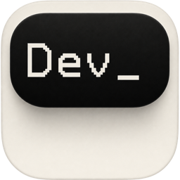

<div align="center">



# Dev Island

**A live status bar for the AI agents working in the background.**

<p>
  <a href="https://devisland.app"></a>
  <a href="https://github.com/sheepxux/Dev-Island/releases/latest"></a>
  <a href="https://github.com/sheepxux/Dev-Island/stargazers"></a>
  
  <a href="LICENSE"></a>
</p>


</div>

## Why this exists

AI agents are useful because they keep working after you switch tabs. That's also
why they're easy to forget about — by the time the result is ready, you've
already moved on three times.

Dev Island gives that background work a small, persistent home on macOS.
A capsule sits in your menu bar (or curls around the notch on a 14"/16" MacBook
Pro), showing how many tasks are in flight and what state they're in. Click it
and the full task list slides down. A task starts asking for input? The bar
turns yellow. Something failed? Red. Everything done? Green. Silence? Gray.

It's a Dynamic Island for the agentic stuff happening on the other side of the
internet.

## What it looks like

<p align="center">
  
</p>

The bar carries five states, ordered by priority — the highest one wins:

| Color | State | Meaning |
| :---: | --- | --- |
| 🟡 | **Waiting** | An agent paused and is asking for input |
| 🔴 | **Failed** | At least one task errored out and you should look |
| 🟢 | **Running** | Work is in flight |
| 🟦 | **Completed** | Done, nothing to do |
| ⚪ | **Idle** | No tasks, or sync is paused |

Hover the bar and it widens to show the current task title plus compact counts
for running, waiting, and failed sessions. Click it and the panel expands into
a scrollable task list. Clicking a task activates its source app or terminal;
when that is unavailable, Dev Island opens its project folder or browser URL.
Click outside or press <kbd>Esc</kbd> to collapse it back.

## Install

### From the website ← *recommended*

Go to **[devisland.app](https://devisland.app)** → click **Download for Mac** →
open **Dev-Island.dmg** → drag **Dev Island.app** onto **Applications**.

(A zip with the identical app ships on every
[release](https://github.com/sheepxux/Dev-Island/releases) for scripted
installs and stable direct-download URLs.)

The app is signed with a Developer ID and notarized by Apple, so it opens with
zero Gatekeeper warnings on first launch.

### Homebrew Cask

*Coming soon.* Once the public tap is published:

```sh
brew tap sheepxux/dev-island
brew install --cask dev-island
```

The Cask will declare `depends_on cask: "cloudflared"` so realtime webhook
updates work out of the box.

### From source

Requires macOS 14+ and a Swift 6 toolchain (Xcode 16 ships one):

```sh
git clone https://github.com/sheepxux/Dev-Island.git
cd Dev-Island
swift run IslandApp           # dev launch
./scripts/build-app.sh        # produces build/Dev Island.app (ad-hoc signed)
```

## First-run setup

The three-step welcome tour explains the island, lets you enable local agents,
and configures notification noise. You can reopen it anytime from Settings.

Local agents need no account: enable Claude Code, Codex, Cursor, or Gemini CLI
in **Settings → Agent Connections**. Manus users can paste an API key (`sk-…`)
in the cloud-agent group. Settings is available from the panel gear, the menu
bar item, or <kbd>⌘,</kbd>.

Keys are stored in the macOS Keychain. Disconnect at any time from the same
settings pane. Optional **Launch at Login** hooks up via `SMAppService`, no
LaunchAgent files dropped on disk.

## How sync works

Dev Island prefers a **realtime webhook** path. When `cloudflared` is on your
`$PATH` (or installed via the Homebrew Cask), the app spins up a tunnel,
registers a webhook with Manus, and receives task transitions as they happen.

If `cloudflared` is missing, broken, or your network blocks the tunnel, the app
falls back to **60-second polling** automatically. You don't lose any state, you
just see updates within a minute instead of a few hundred milliseconds. The app
prints a small "degraded" reason in the status dot tooltip so you know which
mode you're in.

## Sources

| Source | Status |
| --- | --- |
| Manus | ✅ Available |
| Claude Code | ✅ Available (local hooks, no tunnel needed) |
| Codex CLI | ✅ Available (local hooks, no tunnel needed) |
| Gemini CLI | 🧪 In validation (local hooks, no tunnel needed) |
| Cursor | ✅ Available (local hooks, no tunnel needed) |

**Claude Code**, **Codex**, **Gemini CLI** and **Cursor** need no API key: flip
the toggle in *Settings → Agent Connections*. Dev Island installs a local
hook (into `~/.claude/settings.json` / `~/.codex/hooks.json` /
`~/.gemini/settings.json` / `~/.cursor/hooks.json`) that reports the lifecycle
events each source exposes (start / needs-input / approval-request / done /
failed when available) to a localhost-only endpoint. New sessions appear in
the island within milliseconds. Waiting and failed transitions notify by
default; completion banners are opt-in. Clicking a notification reveals and
highlights the exact task, then clicking its card jumps back to the source.

The connector layer is intentionally declarative. Adding a local source means
providing one `LocalAgentDescriptor`, a payload-to-`LocalAgentEvent` mapping,
and a logo; the registry then drives hook installation, routing, Settings, and
jump-back targets.

## Architecture

SPM-native, four targets, single shared contract:

| Target | Role |
| --- | --- |
| `IslandApp` | Tiny `@main` shim + `AppDelegate` |
| `IslandAppLib` | SwiftUI views, windows, animations, settings, notifications |
| `IslandCore` | Connectors, persistence (SQLite + Keychain), webhook server, tunnel |
| `IslandCoreCLI` | Headless integration test harness |

UI ↔ core boundary is the public `TaskStore` surface. Both sides ship in the
same repo because the shared contract evolves together; cross-side breaking
changes go through [`docs/INTERFACE_CONTRACT.md`](docs/INTERFACE_CONTRACT.md).

```
┌────────────────────────────┐    ┌─────────────────────────────────┐
│        IslandAppLib        │    │           IslandCore            │
│                            │    │                                 │
│   IslandRootView   ────────┼───→│   TaskStore.shared              │
│   NotchPanelView           │    │     ├─ ManusAPIClient           │
│   SettingsView             │    │     ├─ TunnelManager (cf'ed)    │
│   StatusDot                │    │     ├─ PollingFallback (60s)    │
│                            │    │     ├─ WebhookServer            │
└────────────────────────────┘    │     └─ SQLiteStore + Keychain   │
                                  └─────────────────────────────────┘
```

## Status

| Area | State |
| --- | --- |
| macOS island UI (notched + non-notched) | ✅ Shipping |
| Manus task sync (polling, webhook fallback path) | ✅ Shipping |
| Settings + Launch at Login + banner notifications | ✅ Shipping |
| Signed + notarized public release | ✅ v0.1.1 on [Releases](https://github.com/sheepxux/Dev-Island/releases) |
| Homebrew Cask tap | 🚧 Draft in `dist/homebrew-island/` |
| Claude Code connector (local hooks) | ✅ Shipping |
| Codex connector (local hooks) | ✅ Shipping |
| Gemini CLI connector | 🧪 Implemented; real-session validation pending |
| Cursor connector (local hooks) | ✅ Shipping |

## Contributing

Ideas, bug reports, and connector PRs welcome. If you're adding a new agent
source, the cleanest entry point is `IslandCore/Sources/IslandCore/Connectors/`
— start by reading `ManusConnector.swift` and the surrounding webhook +
polling glue.

For interface-contract changes (anything touching `TaskStore`'s public API),
see [`docs/INTERFACE_CONTRACT.md`](docs/INTERFACE_CONTRACT.md) first.

## License

[MIT](LICENSE). Use it, fork it, ship your own version with a new icon, send
weird agent task notifications to your friends. Just keep the copyright notice
intact.

---

<div align="center">
  <sub>
    Built with SwiftUI, Hummingbird, SQLite.swift, and a healthy distrust
    of ⌘-Tab.<br>
    <a href="https://devisland.app">devisland.app</a> ·
    <a href="https://github.com/sheepxux/Dev-Island/issues">Issues</a> ·
    <a href="https://github.com/sheepxux/Dev-Island/releases">Releases</a>
  </sub>
</div>
