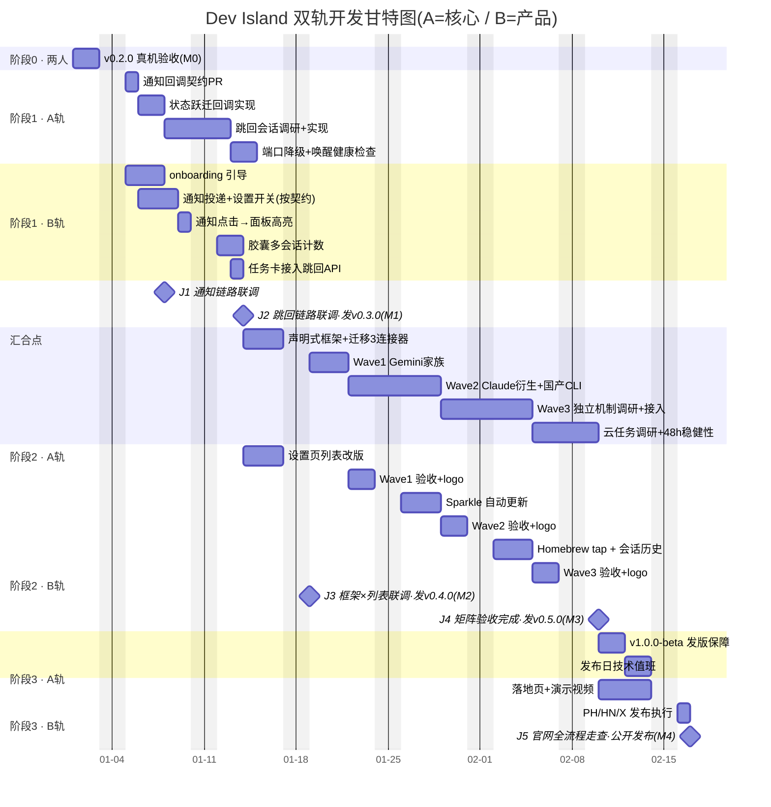

# Dev Island 开发计划

> **产品定位(终局):Every Agent — one notch, one glance。**
> 目标覆盖 26+ 个 agent:Claude Code、Codex、ZCode、Gemini CLI、Antigravity CLI、Cursor、Trae、OpenCode、MiMoCode、Droid、Qoder、Qwen、Grok Build、Kimi Code、DeepSeek、Mistral Vibe、Copilot、CodeBuddy、WorkBuddy、Kiro、Hermes、Amp、Pi Agent、Oh My Pi、Gajae Code…
>
> **当前方向:先把产品做到足够好用、功能足够全面,变现后置。**
> **当前状态:v0.2.0 已发布** —— Manus + Claude Code + Codex + Cursor 四个连接器,签名 + 公证的发布流水线。

---

## 一、里程碑总览

| 里程碑 | 内容 | 出口条件(全部满足才算达成) | 对应发版 |
|---|---|---|---|
| **M0 地基** | v0.2.0 真机验收 | 验收清单 A 全绿,发现的 bug 已修复或立项 | — |
| **M1 价值闭环** | 通知 + 跳回会话 + onboarding | "不盯终端"承诺兑现:审批弹通知、点通知/任务卡直达会话;新用户 3 分钟内跑通第一个会话 | v0.3.0 |
| **M2 框架就绪** | 声明式连接器框架 + Wave 1 | 现有 3 连接器迁移为表驱动且回归全绿;Gemini 家族接入并通过 B 验收;设置页新列表上线 | v0.4.0 |
| **M3 矩阵铺开** | Wave 2 + Wave 3 + 分发 | 矩阵表内 ✅ ≥ 12 家;自动更新可用;Homebrew tap 可安装;48h 挂机稳定 | v0.5.0 |
| **M4 公开发布** | 落地页 + PH/HN 发布 | 官网上线、演示视频完成、发布日执行完毕、48h 值班响应 | v1.0.0-beta |
| **M5 变现**(后置) | license + 支付 | 触发条件:日活稳定 + M1 体验被用户反馈验证 | v1.0.0 |

---

## 二、双轨并行原则与汇合点

两人**始终各自有事做、互不阻塞**,靠三条规则实现:

1. **契约先行**:A 的每个核心功能先出"契约 PR"(只改 `INTERFACE_CONTRACT.md`,冻结 API 形态),B 评审通过即可按契约并行开发 UI,不等 A 的实现落地。
2. **B 永不空转**:等待 A 接口期间,B 手上永远有独立任务(onboarding、视觉、Homebrew、官网)。
3. **汇合点即集成测试**:每个汇合点当天,两边分支都合入 main,当场跑真机联调;发现的问题谁的域谁修,24h 内闭环。

| 汇合点 | 触发时机 | A 交付 | B 交付 | 联调内容 |
|---|---|---|---|---|
| **J1** | 阶段 1 中段 | TaskStore 状态跃迁回调(契约冻结→实现合入) | 通知投递 + 点击唤起面板 | 真实会话触发通知全链路 |
| **J2** | 阶段 1 末 | 跳回会话 API(app 级激活) | 任务卡点击行为接入 | 三个 agent 各跑一次"黄灯→跳回→批准" |
| **J3** | 阶段 2 初 | 声明式框架 API 冻结 | 设置页新列表(分组+搜索)对接 | 现有 4 家在新列表下开关/状态全部正常 |
| **J4** | 每个 Wave 结束 | 该 Wave 连接器合入 | 该 Wave 真机验收 + logo | 验收清单 A 的连接器部分逐家过,B 签字 |
| **J5** | 阶段 3 初 | v0.5.0 发版产物 | 落地页 + 支持矩阵页 | 官网下载链接→安装→跑通全流程走查 |

---

## 三、阶段计划(双轨)

### 阶段 0:地基验收(两人一起,≈2 天)

唯一任务:对照「五、验收清单 A」在两台真机上把 v0.2.0 过一遍。发现的问题按域立 issue,阻塞项当场修。
**出口 = M0。**

### 阶段 1:好用 —— 价值闭环

> 主题:用户装上之后,"不用盯终端"这个承诺真正兑现。

| A(核心)轨 | B(产品)轨 |
|---|---|
| ① 通知回调契约 PR(J1 前置) | ① onboarding 三步引导(独立,先行) |
| ② TaskStore 状态跃迁回调实现:→completed / →waiting / →failed | ② 系统通知投递 + 设置页开关(按契约并行) |
| ③ 跳回会话调研与实现:任务记录来源 app,NSWorkspace app 级激活(J2 前置) | ③ 通知点击 → 展开面板并高亮任务 |
| ④ LocalHookServer 端口占用降级与提示 | ④ 胶囊信息密度:多会话计数(如 `2▶ 1⏸`) |
| ⑤ 休眠唤醒后本地管线健康检查 | ⑤ 任务卡点击行为接入跳回 API(J2 后) |

**汇合点:J1(通知链路)、J2(跳回链路)。出口 = M1,发 v0.3.0。**

### 阶段 2:全面 —— 连接器矩阵铺开

> 主题:"我用的 agent 它都支持",以及长期挂机不出幺蛾子。铺开策略与状态见「四、连接器矩阵」。

| A(核心)轨 | B(产品)轨 |
|---|---|
| ① 声明式框架:现有 3 连接器迁移为表驱动,API 契约冻结(J3 前置) | ① 设置页连接器列表改版:分组 + 搜索 + 状态徽标(J3 对接) |
| ② Wave 1:Gemini CLI + 衍生系(Qwen Code 等) | ② Wave 1 真机验收 + logo(J4) |
| ③ Wave 2:Claude 衍生系与国产 CLI(Kimi Code、DeepSeek、CodeBuddy、Qoder、ZCode、MiMoCode…) | ③ Wave 2 真机验收 + logo(J4) |
| ④ Wave 3:独立机制调研与接入(OpenCode、Copilot、Amp、Kiro、Trae…) | ④ Wave 3 真机验收 + logo(J4) |
| ⑤ ChatGPT / Codex 云任务 API 调研 | ⑤ Sparkle 自动更新接入(独立) |
| ⑥ 长期挂机稳健性:并发压测、TTL 复核、48h 内存观察 | ⑥ Homebrew tap 发布(独立) |
| ⑦ 卸载时 hooks 一键全清 | ⑦ 会话历史视图(SQLite 已有落库基础) |

**汇合点:J3(框架×列表,达成即发 v0.4.0 = M2)、J4(每 Wave 一次,全部 Wave 验收完发 v0.5.0 = M3)。出口 = M3。**

### 阶段 3:公开发布

| A(核心)轨 | B(产品)轨 |
|---|---|
| ① v0.5.0 → v1.0.0-beta 发版与流水线保障 | ① devisland.app 落地页(hero:15 秒状态流转录屏) |
| ② 发布日 issue 值班(技术侧) | ② 演示视频(60-90 秒)+ 支持矩阵页 |
| ③ 用户反馈的核心侧修复 | ③ Product Hunt / HN / X 发布执行 |

**汇合点:J5。出口 = M4。**

### 后置:变现(M5,时机成熟再启动)

方案已调研完毕,直接取用:Lemon Squeezy(MoR 处理全球税务)+ Ed25519 离线校验 + Keychain 存储 + 14 天试用降级(保留 1 个连接器,不锁死)。
A:LicenseManager + webhook 签发;B:激活 UI + 购买跳转 + 定价文案。

---

## 四、双人甘特图

> 起始日期为占位符,只表达**相对排期、并行关系与汇合点**,不承诺日历日期。GitHub 上自动渲染。

阅读要点:

- **B 从不等 A**:J1 契约一冻结,B 的通知 UI 与 A 的回调实现同步推进;A 做框架迁移时 B 改设置页列表。
- **验收窗口错峰**:每个 Wave,A 转入下一波开发的同时 B 验收上一波 —— 流水线式推进。
- 甘特图是**相对排期**,实际以汇合点达成为准;某轨提前完成就从后置事项里拉任务,不空等。

---

## 五、分工与协作规则

沿用仓库既有的 `[S]` / `[C]` 双角色模式,边界是 `docs/INTERFACE_CONTRACT.md`:

| 角色 | 负责范围 | 代码域 |
|---|---|---|
| **A — 核心** `[S]` | 连接器框架与实现、事件管线、数据层、发布流水线 | `IslandCore/`、`IslandCoreCLI/`、`.github/workflows/` |
| **B — 产品** `[C]` | UI/UX、通知、上手引导、连接器实测验收、分发渠道 | `IslandAppLib/`、`IslandApp/`、`dist/` |

**连接器矩阵专项分工:**

| 环节 | 负责人 | 说明 |
|---|---|---|
| 声明式连接器框架 | A | 一个 agent = 一行声明(配置路径 + 格式家族 + 事件词汇表) |
| 每家机制调研 | A | 装真实 CLI 确认家族归属,更新「六、连接器矩阵」 |
| 同族 agent 声明配置 | A 写,B 复核 | PR 附 CLI 端到端记录 |
| 新机制家族攻坚 | A | 先出调研结论再排期 |
| 每家真机实测验收 | **B** | 对照验收清单 A 逐项过,**B 签字后才算"已支持"** |
| 设置页列表改版 / 每家 logo | B | 分组 + 搜索 + 状态徽标;品牌色块替代字母缩写 |
| README / 官网支持矩阵 | B | 对外只宣传 ✅ 的,未验收标 beta |

**协作规则:**

1. A 改动任何 IslandCore 公开 API,必须**同一个 PR 内**更新 `INTERFACE_CONTRACT.md`(版本号 + 变更记录表)。
2. B 只依赖契约文档编程,不直接读 IslandCore 实现细节做假设。
3. 所有变更走 PR → squash 合并 main(分支保护已开启,禁止直接 push main)。
4. 分支命名:`feat/xxx`、`fix/xxx`、`chore/xxx`;提交信息带 `[S]` / `[C]` 前缀标注责任域。
5. 每个汇合点做一次面对面联调;此外每周 30 分钟同步,更新本文档勾选状态。
6. 跨域改动由 A 先出核心 PR,合并后 B 基于 main 出 UI PR,**不搞叠 PR**(v0.2.0 期间叠 PR 被 GitHub 自动关闭过一次,教训)。

---

## 六、连接器矩阵(调研 + 状态总表)

> 状态流转:📋 待调研 → 🔬 调研中 → 🛠 开发中 → 🧪 待 B 验收 → ✅ 已支持 / ❌ 暂不可行(记录原因)
> "家族"指集成机制:`claude-hooks`(~/.xxx/settings.json 嵌套格式)、`gemini-hooks`、`cursor-hooks`(扁平 + version)、`api`(云端轮询/webhook)、`custom`(插件/其他)。

| Agent | 家族(预判) | 状态 | 负责 | 备注 |
|---|---|---|---|---|
| Claude Code | claude-hooks | ✅ | — | v0.2.0 |
| Codex | claude-hooks | ✅ | — | v0.2.0,写 ~/.codex/hooks.json |
| Cursor | cursor-hooks | ✅ | — | v0.2.0,含 stop.status→failed |
| Manus | api | ✅ | — | v0.1.x,轮询 + webhook |
| Gemini CLI | gemini-hooks | 📋 | A | Wave 1 头号目标 |
| Qwen(Qwen Code) | gemini-hooks? | 📋 | A | Gemini CLI 衍生,大概率同族 |
| Kimi Code | claude-hooks? | 📋 | A | 待装机确认 |
| DeepSeek | 📋 | 📋 | A | CLI 形态待确认 |
| ZCode | 📋 | 📋 | A | |
| MiMoCode | 📋 | 📋 | A | |
| CodeBuddy | claude-hooks? | 📋 | A | |
| Qoder | 📋 | 📋 | A | |
| Trae | custom? | 📋 | A | IDE 形态,可能无 CLI hooks |
| OpenCode | custom? | 📋 | A | 有插件/事件 API,单独调研 |
| Copilot | custom? | 📋 | A | Copilot CLI hooks 能力待确认 |
| Amp | 📋 | 📋 | A | |
| Droid | 📋 | 📋 | A | |
| Kiro | custom? | 📋 | A | IDE,自有 agent hooks 概念 |
| Grok Build | 📋 | 📋 | A | |
| Mistral Vibe | 📋 | 📋 | A | |
| Antigravity CLI | 📋 | 📋 | A | |
| Hermes | 📋 | 📋 | A | |
| Pi Agent | 📋 | 📋 | A | |
| Oh My Pi | 📋 | 📋 | A | |
| WorkBuddy | 📋 | 📋 | A | |
| Gajae Code | 📋 | 📋 | A | |
| ChatGPT / Codex 云 | api | 📋 | A | 官方任务状态 API 待调研 |

> 维护:A 每完成一家调研就更新本表;B 验收通过后把状态改成 ✅ 并注明版本。对外(README/官网)只宣传 ✅ 的。

---

## 七、验收清单

### A. v0.2.0 真机验收(M0,阶段 1 开工前必须全过)

**安装与启动:**
- [ ] 从 Releases 下载 `Dev-Island.zip`,解压拖入 /Applications,双击启动**无任何 Gatekeeper 警告**
- [ ] 菜单栏出现胶囊,鼠标悬停展开面板
- [ ] `spctl -a -vv -t exec "/Applications/Dev Island.app"` 输出 accepted / Notarized Developer ID

**三个本地连接器(每个都单独验证):**
- [ ] 设置页打开开关后,对应配置文件里出现我们的 hook 条目,且**用户原有条目原样保留**(`~/.claude/settings.json` / `~/.codex/hooks.json` / `~/.cursor/hooks.json`)
- [ ] 跑一个真实会话:开始 → 岛变蓝(running);结束 → 变绿(completed)
- [ ] Claude Code / Codex:触发一次权限请求 → 变黄(waiting),批准后恢复
- [ ] Cursor:agent 出错中断 → 变红(failed)
- [ ] 关闭开关后,配置文件里我们的条目被干净移除,用户条目仍在
- [ ] Dev Island 完全退出时,跑上述 CLI 会话**不卡顿、不报错**(fire-and-forget 验证)

**共存与恢复:**
- [ ] Manus(有 key 的话)与本地连接器同时显示,互不覆盖
- [ ] 断网状态下本地连接器照常工作
- [ ] 合盖休眠 10 分钟后唤醒,新会话事件仍能进岛
- [ ] 手动占用 7824 端口再启动 app,确认行为(已知薄弱点,阶段 1 修复)

### B. 每个 PR 合并前(双方自查)

- [ ] `swift build && swift test` 本地全绿
- [ ] 改了 IslandCore 公开 API → `INTERFACE_CONTRACT.md` 同 PR 更新
- [ ] 新连接器 / 新功能 → 有单测;涉及 hook → CLI (`swift run IslandCoreCLI local-hooks`) 端到端跑过
- [ ] README 的状态表若受影响则同步更新
- [ ] PR 描述含 Test plan(照抄 #3/#5/#6 的格式)

### C. 每次发版(tag 前)

- [ ] `VERSION` 文件与 tag 一致(流水线会强制校验,不一致直接 fail)
- [ ] main 上 `swift test` 全绿
- [ ] `scripts/build-app.sh` 本地跑通,产物能启动
- [ ] tag 推送后盯流水线到 Release 产物出现(公证偶发排队 20+ 分钟属正常;403 协议错误 → developer.apple.com 重签协议)
- [ ] 从 Releases 下载产物做一次冒烟:安装、启动、开一个连接器
- [ ] Homebrew cask 的 sha256 同步更新(tap 发布后)

### D. 每个汇合点(J1-J5,联调当天)

- [ ] 两轨分支均已合入 main,CI 全绿
- [ ] 真机联调按该汇合点的「联调内容」执行并记录结果
- [ ] 发现的问题按域立 issue,24h 内闭环或明确降级方案
- [ ] 若为发版汇合点(J2/J3/J4),执行清单 C

---

*维护约定:本文档随每个汇合点与每周同步更新;阶段与排期调整走 PR 讨论。*
